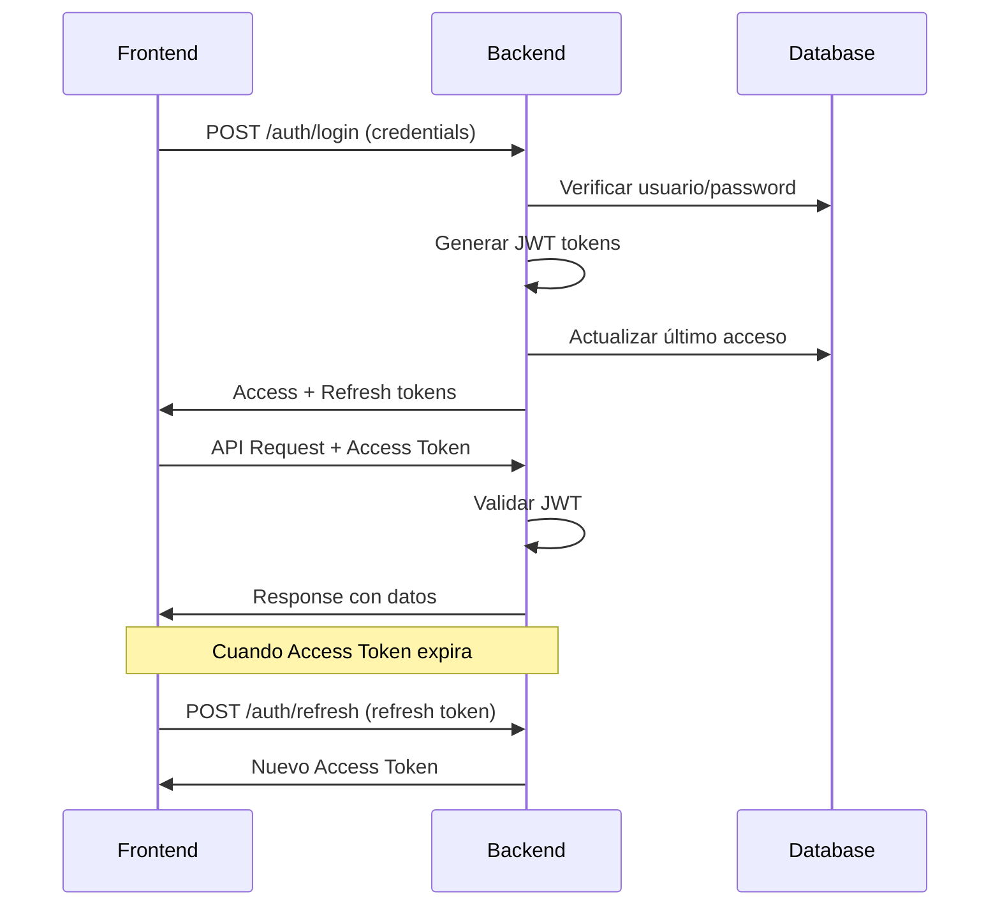

# Autenticación JWT y Sistema de Seguridad Empresarial

## 📋 Tabla de Contenidos
- [Overview](#overview)
- [Nuevos Endpoints](#nuevos-endpoints)
- [Sistema de Roles y Permisos](#sistema-de-roles-y-permisos)
- [Autenticación JWT](#autenticación-jwt)
- [Validaciones y Seguridad](#validaciones-y-seguridad)
- [Trazabilidad y Auditoría](#trazabilidad-y-auditoría)
- [Tipos y DTOs](#tipos-y-dtos)
- [Guía de Implementación Frontend](#guía-de-implementación-frontend)
- [Códigos de Error](#códigos-de-error)

## Overview

Sistema completo de autenticación JWT con control de roles, permisos granulares, aislamiento por empresa y auditoría completa. Implementa seguridad empresarial con trazabilidad total de acciones.

### 🔑 Características Principales
- ✅ **Autenticación JWT** con access y refresh tokens
- ✅ **Sistema multiempresa** con aislamiento completo de datos
- ✅ **Roles jerárquicos** con permisos específicos
- ✅ **Trazabilidad completa** en entidades críticas
- ✅ **Auditoría automática** de todas las acciones
- ✅ **Validaciones de seguridad** por empresa y permisos

---

## Nuevos Endpoints

### 🔐 Autenticación

#### `POST /api/v1/auth/login`
Autentica un usuario y retorna tokens JWT.

**Request:**
```json
{
  "username": "admin",
  "password": "password123"
}
```

**Response (200):**
```json
{
  "success": true,
  "message": "Login exitoso",
  "data": {
    "accessToken": "eyJhbGciOiJIUzI1NiIsInR5cCI6IkpXVCJ9...",
    "refreshToken": "eyJhbGciOiJIUzI1NiIsInR5cCI6IkpXVCJ9...",
    "tokenType": "Bearer",
    "expiresIn": 900,
    "user": {
      "id": 1,
      "username": "admin",
      "nombre": "Administrador Principal",
      "email": "admin@empresa.com",
      "tipoUsuario": "ADMIN",
      "tipoUsuarioDisplayName": "Administrador",
      "empresaId": 1,
      "empresaNombre": "Mi Restaurante",
      "permissions": [
        "MANAGE_USERS",
        "MANAGE_COMPANY",
        "VIEW_REPORTS",
        "MANAGE_PAYMENTS",
        "MANAGE_ORDERS",
        "MANAGE_RESERVATIONS"
      ]
    }
  }
}
```

**Errores:**
- `401` - Credenciales inválidas
- `423` - Cuenta bloqueada (>5 intentos fallidos)
- `403` - Cuenta desactivada

---

#### `POST /api/v1/auth/refresh`
Renueva el access token usando el refresh token.

**Request:**
```json
{
  "refreshToken": "eyJhbGciOiJIUzI1NiIsInR5cCI6IkpXVCJ9..."
}
```

**Response:** Mismo formato que login con nuevo `accessToken`

---

#### `POST /api/v1/auth/logout`
Invalida los tokens del usuario.

**Headers:** `Authorization: Bearer {accessToken}`

**Response (200):**
```json
{
  "success": true,
  "message": "Logout exitoso"
}
```

---

#### `GET /api/v1/auth/me`
Obtiene información del usuario autenticado.

**Headers:** `Authorization: Bearer {accessToken}`

**Response:** Objeto `UserInfo` del usuario actual

---

#### `GET /api/v1/auth/validate`
Valida si el token actual es válido.

**Response (200):**
```json
{
  "success": true,
  "message": "Token válido",
  "data": true
}
```

---

### 📊 Auditoría

#### `GET /api/v1/audit`
Obtiene logs de auditoría de la empresa (paginado).

**Permisos:** `VIEW_REPORTS`, `ALL_PERMISSIONS`

**Query Parameters:**
- `page` (number): Página (default: 0)
- `size` (number): Tamaño página (default: 20)
- `sort` (string): Campo ordenamiento (default: fechaHora)

**Response:**
```json
{
  "success": true,
  "data": {
    "content": [
      {
        "id": 1,
        "usuario": { "id": 1, "username": "admin", "nombre": "Administrador" },
        "empresa": { "idEmpresa": 1, "nombre": "Mi Restaurante" },
        "accion": "CREATE",
        "entidad": "Pedido",
        "entidadId": 15,
        "descripcion": "Crear nuevo pedido",
        "ipAddress": "192.168.1.100",
        "fechaHora": "2024-01-15T10:30:00",
        "exitoso": true
      }
    ],
    "totalElements": 150,
    "totalPages": 8,
    "size": 20,
    "number": 0
  }
}
```

---

#### `GET /api/v1/audit/user/{usuarioId}`
Logs de auditoría de un usuario específico.

**Permisos:** `VIEW_REPORTS`, `MANAGE_USERS`, `ALL_PERMISSIONS`

---

#### `GET /api/v1/audit/entity/{entidad}/{entidadId}`
Logs de auditoría de una entidad específica.

**Permisos:** `VIEW_REPORTS`, `ALL_PERMISSIONS`

**Ejemplo:** `GET /api/v1/audit/entity/Pedido/123`

---

## Sistema de Roles y Permisos

### 🎭 Jerarquía de Roles

```typescript
enum TipoUsuario {
  SUPER_ADMIN = "Super Administrador",    // Todos los permisos
  ADMIN = "Administrador",                // Gestión completa empresa
  GERENTE = "Gerente",                   // Reportes e inventario
  CAJERO = "Cajero",                     // Pagos y órdenes
  MESERO = "Mesero",                     // Órdenes y mesas
  COCINERO = "Cocinero"                  // Cocina y estados
}
```

### 🔑 Permisos por Rol

| Permiso | SUPER_ADMIN | ADMIN | GERENTE | CAJERO | MESERO | COCINERO |
|---------|-------------|-------|---------|--------|--------|----------|
| `ALL_PERMISSIONS` | ✅ | ❌ | ❌ | ❌ | ❌ | ❌ |
| `MANAGE_USERS` | ✅ | ✅ | ❌ | ❌ | ❌ | ❌ |
| `MANAGE_COMPANY` | ✅ | ✅ | ❌ | ❌ | ❌ | ❌ |
| `VIEW_REPORTS` | ✅ | ✅ | ✅ | ❌ | ❌ | ❌ |
| `MANAGE_PAYMENTS` | ✅ | ✅ | ✅ | ✅ | ❌ | ❌ |
| `MANAGE_ORDERS` | ✅ | ✅ | ✅ | ❌ | ✅ | ❌ |
| `VIEW_ORDERS` | ✅ | ✅ | ✅ | ✅ | ✅ | ✅ |
| `MANAGE_RESERVATIONS` | ✅ | ✅ | ✅ | ❌ | ❌ | ❌ |
| `VIEW_RESERVATIONS` | ✅ | ✅ | ✅ | ❌ | ✅ | ❌ |
| `MANAGE_INVENTORY` | ✅ | ✅ | ✅ | ❌ | ❌ | ❌ |
| `MANAGE_TABLES` | ✅ | ✅ | ❌ | ❌ | ✅ | ❌ |
| `MANAGE_CASH_REGISTER` | ✅ | ✅ | ❌ | ✅ | ❌ | ❌ |
| `MANAGE_KITCHEN` | ✅ | ✅ | ❌ | ❌ | ❌ | ✅ |
| `UPDATE_ORDER_STATUS` | ✅ | ✅ | ❌ | ❌ | ❌ | ✅ |

---

## Autenticación JWT

### 🔧 Configuración

**Duración de Tokens:**
- Access Token: 15 minutos (900,000 ms)
- Refresh Token: 7 días (604,800,000 ms)

**Headers Requeridos:**
```
Authorization: Bearer {accessToken}
Content-Type: application/json
```

### 🔄 Flujo de Autenticación



### 🛡️ Validaciones de Token

- **Expiración**: Tokens verificados automáticamente
- **Versioning**: Sistema de invalidación por `tokenVersion`
- **Empresa**: Validación automática de contexto empresarial
- **Permisos**: Verificación granular por endpoint

---

## Validaciones y Seguridad

### 🏢 Aislamiento por Empresa

**Automático en todas las operaciones:**
- Los usuarios solo ven datos de su empresa
- Validación transparente en backend
- Imposible acceso cruzado entre empresas

### 🔒 Validaciones de Permisos

**Nivel de Método:**
```java
@RequirePermission({"MANAGE_ORDERS", "ALL_PERMISSIONS"})
@RequireCompanyContext
@Auditable(action = "CREATE", entity = "Pedido")
public PedidoResponseDTO crearPedido(PedidoRequestDTO request) {
    // Implementación
}
```

**Validaciones Frontend:**
```typescript
// Verificar permisos antes de mostrar UI
if (user.permissions.includes('MANAGE_ORDERS')) {
  // Mostrar botón "Crear Pedido"
}

// Verificar empresa en datos
if (pedido.empresaId !== user.empresaId) {
  // Error: acceso denegado
}
```

### 🚫 Control de Intentos Fallidos

- **Límite**: 5 intentos fallidos
- **Bloqueo**: Automático después del límite
- **Reset**: Manual por administrador o tiempo
- **Auditoría**: Registro de todos los intentos

---

## Trazabilidad y Auditoría

### 📊 Entidades con Trazabilidad Completa

| Entidad | Usuario Creador | Usuario Asignado | Empresa | Auditoría |
|---------|----------------|------------------|---------|-----------|
| **Pedidos** | ✅ `usuarioCreacion` | ✅ `empleado` | ✅ | ✅ |
| **Pagos** | ✅ `usuarioCreacion` | - | ✅ | ✅ |
| **Reservas** | ✅ `usuarioCreacion` | - | ✅ | ✅ |

### 📝 Información de Auditoría

**Cada registro incluye:**
- Usuario que realizó la acción
- Empresa en contexto
- IP address y User Agent
- Timestamp preciso
- Detalles de la operación
- Estado (exitoso/fallido)
- Parámetros utilizados

**Acciones Auditadas:**
- `LOGIN` / `LOGIN_FAILED` / `LOGOUT`
- `CREATE` / `UPDATE` / `DELETE`
- `VIEW` (para datos sensibles)
- `CHANGE_STATUS`
- `EXPORT` / `IMPORT`

---

## Tipos y DTOs

### 🔐 AuthRequest
```typescript
interface AuthRequest {
  username: string;        // Requerido, 1-50 caracteres
  password: string;        // Requerido, mínimo 6 caracteres
}
```

### 📤 AuthResponse
```typescript
interface AuthResponse {
  accessToken: string;     // JWT access token
  refreshToken: string;    // JWT refresh token
  tokenType: "Bearer";     // Siempre "Bearer"
  expiresIn: number;       // Segundos hasta expiración
  user: UserInfo;          // Información del usuario
}

interface UserInfo {
  id: number;
  username: string;
  nombre: string;
  email: string;
  tipoUsuario: TipoUsuario;
  tipoUsuarioDisplayName: string;
  empresaId: number;
  empresaNombre: string;
  permissions: string[];   // Array de permisos
}
```

### 🔄 RefreshTokenRequest
```typescript
interface RefreshTokenRequest {
  refreshToken: string;    // Requerido, JWT refresh token
}
```

### 📊 PedidoResponseDTO (Actualizado)
```typescript
interface PedidoResponseDTO {
  idPedido: number;
  cliente?: ClienteResponseDTO;
  mesa?: MesaResponseDTO;
  empleado?: UsuarioResponseDTO;      // Mesero asignado
  usuarioCreacion?: UsuarioResponseDTO; // 🆕 Usuario que creó
  fechaPedido: string;                // ISO DateTime
  estado: EstadoPedido;
  tipoServicio: TipoServicio;
  subtotal: number;
  impuestos: number;
  descuento: number;
  total: number;
  observaciones?: string;
  direccionDelivery?: string;
  detalles: DetallePedidoResponseDTO[];
}
```

### 📋 AuditLogResponse
```typescript
interface AuditLogResponse {
  id: number;
  usuario: {
    id: number;
    username: string;
    nombre: string;
  };
  empresa: {
    idEmpresa: number;
    nombre: string;
  };
  accion: string;           // CREATE, UPDATE, DELETE, etc.
  entidad: string;          // Pedido, Pago, Reserva, etc.
  entidadId?: number;       // ID del registro afectado
  descripcion: string;
  detallesAdicionales?: string; // JSON con datos extra
  ipAddress: string;
  userAgent?: string;
  fechaHora: string;        // ISO DateTime
  exitoso: boolean;
  mensajeError?: string;
}
```

### 🔢 Enums

```typescript
enum TipoUsuario {
  SUPER_ADMIN = "SUPER_ADMIN",
  ADMIN = "ADMIN",
  GERENTE = "GERENTE",
  CAJERO = "CAJERO",
  MESERO = "MESERO",
  COCINERO = "COCINERO"
}

enum EstadoUsuario {
  ACTIVO = "ACTIVO",
  INACTIVO = "INACTIVO",
  SUSPENDIDO = "SUSPENDIDO"
}

// Permisos disponibles
type Permission =
  | "ALL_PERMISSIONS"
  | "MANAGE_USERS"
  | "MANAGE_COMPANY"
  | "VIEW_REPORTS"
  | "MANAGE_PAYMENTS"
  | "MANAGE_ORDERS"
  | "VIEW_ORDERS"
  | "MANAGE_RESERVATIONS"
  | "VIEW_RESERVATIONS"
  | "MANAGE_INVENTORY"
  | "MANAGE_TABLES"
  | "MANAGE_CASH_REGISTER"
  | "MANAGE_KITCHEN"
  | "UPDATE_ORDER_STATUS";
```

---

## Guía de Implementación Frontend

### 🚀 Configuración Inicial

```typescript
// Configuración de Axios para Mozaico
import axios from 'axios';

const api = axios.create({
  baseURL: 'http://localhost:8091/api/v1',
  headers: {
    'Content-Type': 'application/json'
  },
  timeout: 10000 // 10 segundos de timeout
});

// Interceptor para agregar token automáticamente
api.interceptors.request.use((config) => {
  const token = localStorage.getItem('accessToken');
  if (token) {
    config.headers.Authorization = `Bearer ${token}`;
  }
  return config;
});

// Interceptor para manejar refresh automático
api.interceptors.response.use(
  (response) => response,
  async (error) => {
    if (error.response?.status === 401) {
      const refreshToken = localStorage.getItem('refreshToken');
      if (refreshToken) {
        try {
          const response = await axios.post('/auth/refresh', {
            refreshToken
          });
          const { accessToken } = response.data.data;
          localStorage.setItem('accessToken', accessToken);

          // Reintentar request original
          error.config.headers.Authorization = `Bearer ${accessToken}`;
          return api.request(error.config);
        } catch (refreshError) {
          // Refresh falló, redireccionar a login
          localStorage.clear();
          window.location.href = '/login';
        }
      }
    }
    return Promise.reject(error);
  }
);
```

### 🔐 Servicio de Autenticación

```typescript
export class AuthService {

  async login(username: string, password: string): Promise<UserInfo> {
    const response = await api.post<ApiResponse<AuthResponse>>('/auth/login', {
      username,
      password
    });

    const { accessToken, refreshToken, user } = response.data.data;

    // Guardar tokens
    localStorage.setItem('accessToken', accessToken);
    localStorage.setItem('refreshToken', refreshToken);
    localStorage.setItem('user', JSON.stringify(user));

    return user;
  }

  async logout(): Promise<void> {
    try {
      await api.post('/auth/logout');
    } finally {
      localStorage.clear();
      window.location.href = '/login';
    }
  }

  getCurrentUser(): UserInfo | null {
    const userStr = localStorage.getItem('user');
    return userStr ? JSON.parse(userStr) : null;
  }

  hasPermission(permission: Permission): boolean {
    const user = this.getCurrentUser();
    return user?.permissions.includes(permission) || false;
  }

  hasAnyPermission(permissions: Permission[]): boolean {
    return permissions.some(p => this.hasPermission(p));
  }
}
```

### 🛡️ Guards de Rutas

```typescript
// React Router Guard
export const ProtectedRoute: React.FC<{
  children: React.ReactNode;
  permissions?: Permission[];
}> = ({ children, permissions = [] }) => {
  const authService = new AuthService();
  const user = authService.getCurrentUser();

  if (!user) {
    return <Navigate to="/login" />;
  }

  if (permissions.length > 0 && !authService.hasAnyPermission(permissions)) {
    return <div>Acceso denegado - Permisos insuficientes</div>;
  }

  return <>{children}</>;
};

// Uso en rutas
<Route
  path="/pedidos"
  element={
    <ProtectedRoute permissions={['MANAGE_ORDERS', 'VIEW_ORDERS']}>
      <PedidosPage />
    </ProtectedRoute>
  }
/>
```

### 🎨 Componentes Condicionales

```typescript
// Componente para mostrar/ocultar según permisos
export const HasPermission: React.FC<{
  permissions: Permission[];
  children: React.ReactNode;
  fallback?: React.ReactNode;
}> = ({ permissions, children, fallback = null }) => {
  const authService = new AuthService();

  if (authService.hasAnyPermission(permissions)) {
    return <>{children}</>;
  }

  return <>{fallback}</>;
};

// Uso en componentes
<HasPermission permissions={['MANAGE_ORDERS']}>
  <Button onClick={crearPedido}>Crear Pedido</Button>
</HasPermission>

<HasPermission
  permissions={['VIEW_REPORTS']}
  fallback={<span>Sin permisos para ver reportes</span>}
>
  <ReportesComponent />
</HasPermission>
```

### 📊 Manejo de Estados

```typescript
// Store de usuario (Redux/Zustand/Context)
interface AuthState {
  user: UserInfo | null;
  isAuthenticated: boolean;
  permissions: Permission[];
  empresaId: number | null;
}

const authSlice = createSlice({
  name: 'auth',
  initialState: {
    user: null,
    isAuthenticated: false,
    permissions: [],
    empresaId: null
  } as AuthState,
  reducers: {
    loginSuccess: (state, action: PayloadAction<UserInfo>) => {
      state.user = action.payload;
      state.isAuthenticated = true;
      state.permissions = action.payload.permissions;
      state.empresaId = action.payload.empresaId;
    },
    logout: (state) => {
      state.user = null;
      state.isAuthenticated = false;
      state.permissions = [];
      state.empresaId = null;
    }
  }
});
```

### 🔄 Servicios de API

```typescript
export class PedidoService {

  async crearPedido(pedido: PedidoRequestDTO): Promise<PedidoResponseDTO> {
    // No necesitas enviar usuarioCreacion ni empresaId
    // El backend los obtiene automáticamente del JWT
    const response = await api.post<ApiResponse<PedidoResponseDTO>>('/pedidos', pedido);
    return response.data.data;
  }

  async obtenerPedidos(): Promise<PedidoResponseDTO[]> {
    // Solo retorna pedidos de la empresa del usuario actual
    const response = await api.get<ApiResponse<PedidoResponseDTO[]>>('/pedidos');
    return response.data.data;
  }

  async obtenerPedidoPorId(id: number): Promise<PedidoResponseDTO> {
    const response = await api.get<ApiResponse<PedidoResponseDTO>>(`/pedidos/${id}`);
    return response.data.data;
  }
}

export class CompraService {

  async crearCompra(compra: CompraRequestDTO): Promise<CompraResponseDTO> {
    // Usuario y empresa se asignan automáticamente desde el JWT
    const response = await api.post<ApiResponse<CompraResponseDTO>>('/compras', compra);
    return response.data.data;
  }

  async obtenerCompras(): Promise<CompraResponseDTO[]> {
    // Solo compras de la empresa del usuario actual
    const response = await api.get<ApiResponse<CompraResponseDTO[]>>('/compras');
    return response.data.data;
  }

  async cambiarEstadoCompra(id: number, estado: EstadoCompra): Promise<CompraResponseDTO> {
    const response = await api.patch<ApiResponse<CompraResponseDTO>>(
      `/compras/${id}/estado`,
      { estado }
    );
    return response.data.data;
  }
}

export class AuditService {

  async obtenerAuditLogs(page = 0, size = 20): Promise<Page<AuditLogResponse>> {
    const response = await api.get<ApiResponse<Page<AuditLogResponse>>>(
      `/audit?page=${page}&size=${size}`
    );
    return response.data.data;
  }

  async obtenerAuditPorUsuario(usuarioId: number): Promise<AuditLogResponse[]> {
    const response = await api.get<ApiResponse<AuditLogResponse[]>>(
      `/audit/user/${usuarioId}`
    );
    return response.data.data;
  }
}
```

---

## Códigos de Error

### 🚨 Códigos HTTP

| Código | Descripción | Cuándo Ocurre |
|--------|-------------|---------------|
| `200` | ✅ Éxito | Operación exitosa |
| `400` | ❌ Bad Request | Datos inválidos o faltantes |
| `401` | 🔐 Unauthorized | Token inválido/expirado o credenciales incorrectas |
| `403` | 🚫 Forbidden | Sin permisos suficientes o empresa incorrecta |
| `404` | 🔍 Not Found | Recurso no existe o no pertenece a la empresa |
| `409` | ⚠️ Conflict | Datos duplicados (username, email, documento) |
| `423` | 🔒 Locked | Cuenta bloqueada por intentos fallidos |
| `500` | 💥 Server Error | Error interno del servidor |

### 📝 Estructura de Errores

```typescript
interface ApiResponse<T> {
  success: boolean;
  message: string;
  data?: T;
  error?: {
    code: number;
    message: string;
    details?: any;
  };
}

// Ejemplo de error
{
  "success": false,
  "message": "Permisos insuficientes",
  "error": {
    "code": 403,
    "message": "No tienes permisos suficientes para realizar esta acción",
    "details": {
      "requiredPermissions": ["MANAGE_ORDERS"],
      "userPermissions": ["VIEW_ORDERS"]
    }
  }
}
```

### 🛠️ Manejo de Errores Frontend

```typescript
// Interceptor global de errores
api.interceptors.response.use(
  (response) => response,
  (error) => {
    const { status, data } = error.response || {};

    switch (status) {
      case 401:
        // Token inválido - redireccionar a login
        authService.logout();
        break;

      case 403:
        // Sin permisos - mostrar mensaje
        toast.error(data.message || 'Acceso denegado');
        break;

      case 404:
        // Recurso no encontrado
        toast.error('Recurso no encontrado');
        break;

      case 423:
        // Cuenta bloqueada
        toast.error('Cuenta bloqueada. Contacte al administrador');
        break;

      default:
        toast.error(data.message || 'Error inesperado');
    }

    return Promise.reject(error);
  }
);
```

---

## 📋 Checklist de Implementación

### ✅ Backend (100% Completado)
- [x] **Autenticación JWT completa** con access/refresh tokens
- [x] **Sistema de roles jerárquico** (6 roles: SUPER_ADMIN → COCINERO)
- [x] **14 permisos granulares** correctamente asignados
- [x] **Aislamiento multiempresa** automático en todas las operaciones
- [x] **Trazabilidad completa** en Pedidos, Pagos, Compras y Reservas
- [x] **Auditoría automática** con @Auditable en servicios críticos
- [x] **Validaciones de seguridad** con @RequirePermission y @RequireCompanyContext
- [x] **Manejo de errores** con códigos HTTP específicos y mensajes claros
- [x] **Control de intentos fallidos** (máximo 5 intentos)
- [x] **Configuración JWT** optimizada (access: 15min, refresh: 7 días)
- [x] **SecurityConfig** actualizado sin deprecaciones
- [x] **Endpoints de auditoría** funcionando correctamente

### 🔄 Frontend (Por Implementar)
- [ ] Configuración de Axios con interceptors
- [ ] Servicio de autenticación
- [ ] Guards de rutas por permisos
- [ ] Componentes condicionales
- [ ] Manejo de estados de usuario
- [ ] Servicios de API actualizados
- [ ] Manejo global de errores
- [ ] UI de login/logout
- [ ] Indicadores de permisos en interfaz

### 🧪 Testing (Recomendado)
- [ ] Tests de autenticación
- [ ] Tests de autorización por roles
- [ ] Tests de aislamiento por empresa
- [ ] Tests de auditoría
- [ ] Tests de manejo de errores
- [ ] Tests de refresh de tokens

---

## 🎯 Próximos Pasos

1. **Implementar frontend** siguiendo esta guía
2. **Testing completo** de flujos de autenticación
3. **Configurar entornos** (dev, staging, prod)
4. **Documentar APIs** en Swagger/OpenAPI
5. **Optimizar performance** de consultas
6. **Monitoreo** de seguridad y auditoría

---

## ⚙️ Configuración del Servidor

### 🔧 Variables de Entorno Importantes
```properties
# Servidor
server.port=8091

# JWT
app.jwt.secret=NzIyZTJlNjFhMTdkNDkzYjRjMmI4NjkwYWIyMGVjMzU5OWQ1MTkxMGRkMzM4YzJkZGI5NmYyYTA2ZDY4NzMxOWExN2Q5MTQwM2E1OGIzNGM4ZWI2ZWI1NzZlNmZlNDFkYTlmZDYzZDNjYjU2ZGMyMGY0OTdlY2Q1ODhmOWI5OTQ=
app.jwt.access.expiration=900000     # 15 minutos
app.jwt.refresh.expiration=604800000 # 7 días

# CORS (Frontend Vue.js)
cors.allowed-origins=http://localhost:5173
```

### 🌐 URLs del Sistema
- **Backend API**: `http://localhost:8091/api/v1`
- **Frontend Vue**: `http://localhost:5173`
- **Swagger UI**: `http://localhost:8091/swagger-ui.html`
- **Base de Datos**: `postgresql://localhost:5432/mozaico_db`

---

## 📞 Soporte

Para dudas o problemas:
- **Auditoría**: Revisar logs en `/api/v1/audit`
- **Usuario Actual**: Verificar permisos en `/api/v1/auth/me`
- **Errores**: Consultar códigos HTTP en respuestas de API
- **Configuración**: Validar JWT en `application.properties`
- **Compilación**: Verificar que no hay deprecaciones con `./mvnw compile`

---

*Documento generado para Mozaico v1.0 - Sistema de Gestión de Restaurante*
*Fecha: 28 de Septiembre, 2025*
*Autor: Claude Code Assistant*
*Versión: 1.0 - Actualizada y Verificada*