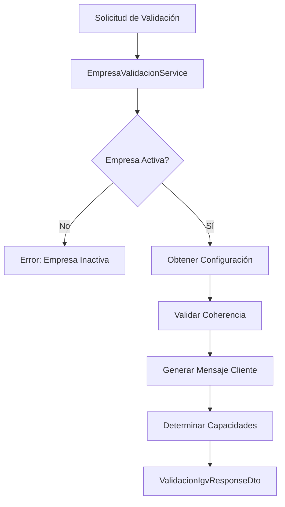
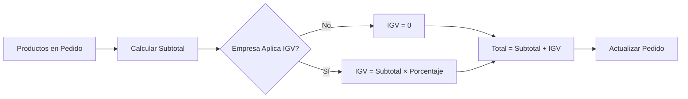

# 🏢 Sistema de Empresa y Configuración - Mozaico

## 📖 Documentación Técnica

### 🎯 **Objetivo**
El Sistema de Empresa permite gestionar la configuración empresarial de manera flexible, desde un negocio informal sin RUC hasta una empresa con facturación electrónica completa, adaptándose automáticamente a las necesidades y capacidades legales del negocio.

---

## 🏗️ **Arquitectura del Sistema**

### **Patrón de Diseño**
- **Domain-Driven Design (DDD)**: Entidades separadas por responsabilidades
- **Strategy Pattern**: Diferentes estrategias según tipo de operación
- **Builder Pattern**: Construcción flexible de entidades
- **Repository Pattern**: Acceso a datos especializado

### **Estructura de Capas**
```
📁 domain/
├── entities/           # Entidades principales
├── enums/             # Enumeraciones de negocio
└── repositories/      # Interfaces de acceso a datos

📁 application/
├── services/          # Lógica de negocio
└── dtos/             # Objetos de transferencia

📁 infrastructure/
└── controllers/       # API REST
```

---

## 🔧 **Configuración Empresarial**

### **Configuración Actual (Negocio Informal)**
```yaml
Empresa: "Restaurante Mozaico"
Tipo de Operación: TICKET_SIMPLE
Aplica IGV: false
Estado: Negocio informal sin RUC
Capacidades:
  - ✅ Tickets internos
  - ❌ Boletas oficiales
  - ❌ Facturas
  - ❌ Comprobantes electrónicos
```

### **Tipos de Operación Disponibles**

#### 🎟️ **TICKET_SIMPLE**
- **Uso**: Negocios informales sin RUC
- **Comprobantes**: Solo tickets internos sin valor tributario
- **IGV**: No aplica
- **Ejemplo**: Pequeños restaurantes, cafeterías familiares

#### 📄 **BOLETA_MANUAL**
- **Uso**: Negocios con RUC, sin facturación electrónica
- **Comprobantes**: Boletas manuales
- **IGV**: Aplica (18%)
- **Ejemplo**: Pequeños comercios formalizados

#### ✅ **FACTURACION_ELECTRONICA**
- **Uso**: Empresas con facturación electrónica SUNAT
- **Comprobantes**: Facturas, boletas electrónicas, notas
- **IGV**: Aplica (18%)
- **Ejemplo**: Empresas medianas y grandes

#### 🔄 **MIXTO**
- **Uso**: Empresas que combinan tickets y comprobantes oficiales
- **Comprobantes**: Todos los tipos
- **IGV**: Configurable
- **Ejemplo**: Restaurantes con múltiples puntos de venta

---

## 💾 **Modelo de Datos**

### **Entidad Principal: `Empresa`**
```sql
CREATE TABLE empresas (
    id_empresa BIGINT PRIMARY KEY AUTO_INCREMENT,
    nombre VARCHAR(200) NOT NULL,
    descripcion TEXT,
    direccion TEXT,
    telefono VARCHAR(20),
    email VARCHAR(100),
    logo_url VARCHAR(255),
    pagina_web VARCHAR(255),
    activa BOOLEAN NOT NULL DEFAULT TRUE,
    
    -- Configuración operacional
    tipo_operacion ENUM('TICKET_SIMPLE', 'BOLETA_MANUAL', 'FACTURACION_ELECTRONICA', 'MIXTO') NOT NULL DEFAULT 'TICKET_SIMPLE',
    aplica_igv BOOLEAN NOT NULL DEFAULT FALSE,
    porcentaje_igv DECIMAL(5,2) DEFAULT 18.00,
    moneda VARCHAR(3) DEFAULT 'PEN',
    
    -- Numeración interna
    correlativo_ticket BIGINT DEFAULT 1,
    prefijo_ticket VARCHAR(10) DEFAULT 'TKT',
    
    -- Auditoría
    fecha_creacion TIMESTAMP DEFAULT CURRENT_TIMESTAMP,
    fecha_actualizacion TIMESTAMP DEFAULT CURRENT_TIMESTAMP ON UPDATE CURRENT_TIMESTAMP
);
```

### **Entidad Opcional: `DatosFacturacion`**
```sql
CREATE TABLE datos_facturacion (
    id_datos_facturacion BIGINT PRIMARY KEY AUTO_INCREMENT,
    id_empresa BIGINT NOT NULL,
    
    -- Datos SUNAT
    ruc VARCHAR(11) UNIQUE,
    razon_social VARCHAR(300),
    nombre_comercial VARCHAR(300),
    direccion_fiscal TEXT,
    ubigeo VARCHAR(6),
    
    -- Estado de formalización
    estado_formalizacion ENUM('SIN_RUC', 'CON_RUC_INACTIVO', 'CON_RUC_ACTIVO', 'EN_TRAMITE') DEFAULT 'SIN_RUC',
    tipo_contribuyente ENUM('PERSONA_NATURAL', 'PERSONA_JURIDICA', 'ENTIDAD_PUBLICA'),
    regimen_tributario ENUM('GENERAL', 'ESPECIAL', 'MYPE', 'NUEVO_RUS', 'AGRARIO', 'AMAZONICO'),
    
    -- Facturación electrónica
    facturacion_electronica_activa BOOLEAN DEFAULT FALSE,
    serie_factura VARCHAR(4),
    serie_boleta VARCHAR(4),
    correlativo_factura BIGINT DEFAULT 1,
    correlativo_boleta BIGINT DEFAULT 1,
    
    -- Configuración técnica
    ose_proveedor VARCHAR(100),
    ose_endpoint VARCHAR(255),
    
    FOREIGN KEY (id_empresa) REFERENCES empresas(id_empresa)
);
```

---

## 🔍 **Sistema de Validación**

### **Flujo de Validación**


### **Validaciones Automáticas**

#### ✅ **Validaciones de Coherencia**
- IGV activado ↔ Configuración de empresa formal
- Tipo de operación ↔ Datos de facturación disponibles
- Series de comprobantes ↔ Facturación electrónica activa

#### ⚠️ **Detección de Inconsistencias**
- Empresa aplica IGV pero no tiene RUC
- Facturación electrónica sin datos SUNAT
- Series sin numeración correlativa

#### 🚨 **Advertencias Generadas**
- Configuración incompleta
- Limitaciones operativas
- Recomendaciones de mejora

---

## 🎮 **API REST - Endpoints**

### **Base URL**: `/api/v1/empresa/validacion`

#### **GET `/igv`** - Validación Completa
**Respuesta exitosa (200):**
```json
{
  "aplicaIgv": false,
  "porcentajeIgv": 18.00,
  "moneda": "PEN",
  "tipoOperacion": "TICKET_SIMPLE",
  "puedeEmitirFacturas": false,
  "puedeEmitirBoletas": false,
  "puedeEmitirTickets": true,
  "facturacionElectronicaActiva": false,
  "mensajeCliente": "🎟️ Esta empresa opera como negocio informal. Los comprobantes emitidos son tickets internos sin valor tributario y NO incluyen IGV.",
  "tipoComprobanteDisponible": "Ticket interno",
  "comprobantesPermitidos": [
    "Ticket interno sin valor tributario"
  ],
  "nombreEmpresa": "Restaurante Mozaico",
  "ruc": null,
  "tieneRuc": false,
  "incluyeIgvEnPrecio": false,
  "formatoNumeracion": "MOZ-########",
  "prefijoComprobante": "MOZ",
  "empresaActiva": true,
  "configuracionValida": true,
  "advertencias": [],
  "limitaciones": [
    "Solo puede emitir tickets internos sin valor tributario",
    "No puede emitir comprobantes válidos ante SUNAT",
    "No puede incluir IGV en los comprobantes"
  ]
}
```

#### **GET `/aplica-igv`** - Verificación Rápida
**Respuesta exitosa (200):**
```json
false
```

#### **GET `/porcentaje-igv`** - Porcentaje Configurado
**Respuesta exitosa (200):**
```json
18.00
```

#### **GET `/mensaje-cliente`** - Mensaje para Cliente
**Respuesta exitosa (200):**
```text
🎟️ Esta empresa opera como negocio informal. Los comprobantes emitidos son tickets internos sin valor tributario y NO incluyen IGV.
```

---

## 🧮 **Sistema de Cálculos**

### **Cálculo Dinámico de Totales**

#### **Flujo de Cálculo**


#### **Código de Ejemplo**
```java
// En PedidoCalculoService
public PedidoCalculoResult calcularTotalesPedido(Pedido pedido) {
    // 1. Validar configuración empresa
    ValidacionIgvResponseDto validacion = empresaValidacionService.validarConfiguracionIgv();
    
    // 2. Calcular subtotal
    BigDecimal subtotal = calcularSubtotal(pedido);
    
    // 3. Aplicar IGV según configuración
    BigDecimal igv = BigDecimal.ZERO;
    if (validacion.getAplicaIgv()) {
        igv = subtotal.multiply(validacion.getPorcentajeIgv())
                .divide(new BigDecimal("100"), 2, RoundingMode.HALF_UP);
    }
    
    // 4. Calcular total
    BigDecimal total = subtotal.add(igv);
    
    return resultado;
}
```

---

## 📱 **Integración Frontend**

### **Verificación Inicial**
```javascript
class EmpresaValidator {
    async verificarConfiguracion() {
        try {
            const response = await fetch('/api/v1/empresa/validacion/igv');
            const validacion = await response.json();
            
            // Configurar interfaz según capacidades
            this.configurarInterfaz(validacion);
            
            // Mostrar mensaje al cliente
            this.mostrarMensajeCliente(validacion.mensajeCliente);
            
            return validacion;
        } catch (error) {
            console.error('Error al verificar configuración:', error);
            this.mostrarErrorConfiguracion();
        }
    }
    
    configurarInterfaz(validacion) {
        // Habilitar/deshabilitar opciones según capacidades
        const facturasBtn = document.getElementById('btn-facturas');
        const boletasBtn = document.getElementById('btn-boletas');
        const ticketsBtn = document.getElementById('btn-tickets');
        
        facturasBtn.disabled = !validacion.puedeEmitirFacturas;
        boletasBtn.disabled = !validacion.puedeEmitirBoletas;
        ticketsBtn.disabled = !validacion.puedeEmitirTickets;
        
        // Configurar calculadora de precios
        this.calculator.setIgvEnabled(validacion.aplicaIgv);
        this.calculator.setIgvPercentage(validacion.porcentajeIgv);
    }
    
    mostrarMensajeCliente(mensaje) {
        const alertDiv = document.createElement('div');
        alertDiv.className = 'alert alert-info';
        alertDiv.innerHTML = `<i class="fas fa-info-circle"></i> ${mensaje}`;
        
        document.getElementById('info-empresa').appendChild(alertDiv);
    }
}
```

### **Cálculo de Precios en Tiempo Real**
```javascript
class PriceCalculator {
    constructor() {
        this.igvEnabled = false;
        this.igvPercentage = 18.00;
    }
    
    async initialize() {
        const validacion = await fetch('/api/v1/empresa/validacion/igv').then(r => r.json());
        this.igvEnabled = validacion.aplicaIgv;
        this.igvPercentage = validacion.porcentajeIgv;
    }
    
    calculateTotal(items) {
        const subtotal = items.reduce((sum, item) => sum + (item.price * item.quantity), 0);
        
        let igv = 0;
        if (this.igvEnabled) {
            igv = subtotal * (this.igvPercentage / 100);
        }
        
        return {
            subtotal: subtotal.toFixed(2),
            igv: igv.toFixed(2),
            total: (subtotal + igv).toFixed(2),
            includesIgv: this.igvEnabled
        };
    }
}
```

---

## 🔄 **Casos de Migración**

### **Escenario 1: De Informal a Formal**

#### **Estado Inicial (Actual)**
```yaml
Empresa:
  aplicaIgv: false
  tipoOperacion: TICKET_SIMPLE
  datosFacturacion: null
```

#### **Migración Paso a Paso**
```java
// 1. Obtener RUC
empresa.setAplicaIgv(true);
empresa.setTipoOperacion(TipoOperacion.BOLETA_MANUAL);

// 2. Crear datos de facturación
DatosFacturacion datos = DatosFacturacion.builder()
    .ruc("20123456789")
    .razonSocial("Restaurante Mozaico E.I.R.L.")
    .estadoFormalizacion(EstadoFormalizacion.CON_RUC_INACTIVO)
    .facturacionElectronicaActiva(false)
    .empresa(empresa)
    .build();

// 3. Actualizar configuración
empresaRepository.save(empresa);
datosFacturacionRepository.save(datos);
```

#### **Estado Final**
```yaml
Empresa:
  aplicaIgv: true
  tipoOperacion: BOLETA_MANUAL
  datosFacturacion:
    ruc: "20123456789"
    estadoFormalizacion: CON_RUC_INACTIVO
```

### **Escenario 2: A Facturación Electrónica**

#### **Configuración Final**
```java
// Activar facturación electrónica
datos.setFacturacionElectronicaActiva(true);
datos.setEstadoFormalizacion(EstadoFormalizacion.CON_RUC_ACTIVO);
datos.setSerieFactura("F001");
datos.setSerieBoleta("B001");
datos.setOseProveedor("SUNAT");

empresa.setTipoOperacion(TipoOperacion.FACTURACION_ELECTRONICA);
```

---

## 🧪 **Testing y Validaciones**

### **Tests de Validación**
```java
@Test
void debeValidarEmpresaInformal() {
    // Given
    Empresa empresa = crearEmpresaInformal();
    
    // When
    ValidacionIgvResponseDto validacion = empresaValidacionService.validarConfiguracionIgv();
    
    // Then
    assertThat(validacion.getAplicaIgv()).isFalse();
    assertThat(validacion.getTipoOperacion()).isEqualTo(TipoOperacion.TICKET_SIMPLE);
    assertThat(validacion.getPuedeEmitirFacturas()).isFalse();
    assertThat(validacion.getMensajeCliente()).contains("negocio informal");
}

@Test
void debeCalcularTotalSinIgv() {
    // Given
    configurarEmpresaSinIgv();
    Pedido pedido = crearPedidoConItems();
    
    // When
    PedidoCalculoResult resultado = pedidoCalculoService.calcularTotalesPedido(pedido);
    
    // Then
    assertThat(resultado.getIgv()).isEqualTo(BigDecimal.ZERO);
    assertThat(resultado.getTotal()).isEqualTo(resultado.getSubtotal());
}
```

### **Scenarios de Prueba**
- ✅ Empresa informal sin IGV
- ✅ Empresa formal con IGV
- ✅ Migración entre estados
- ✅ Validaciones de coherencia
- ✅ Cálculos dinámicos
- ✅ Mensajes para clientes

---

## 📊 **Métricas y Monitoreo**

### **Logs de Sistema**
```java
// En DataLoader
System.out.println("🎟️ Empresa informal - Sin IGV aplicado");
System.out.println("💰 IGV aplicado: 18.0% = S/ 3.24");
```

### **Métricas Sugeridas**
- Número de validaciones por día
- Tipos de comprobantes emitidos
- Errores de configuración detectados
- Tiempo de respuesta de validaciones

---

## 🚀 **Roadmap Futuro**

### **Funcionalidades Planificadas**
- [ ] Múltiples empresas por instalación
- [ ] Configuración de múltiples series
- [ ] Integración directa con OSE
- [ ] Dashboard de configuración
- [ ] Reportes de cumplimiento SUNAT
- [ ] Backup automático de configuración

### **Mejoras Técnicas**
- [ ] Cache de validaciones
- [ ] Eventos de cambio de configuración
- [ ] Validaciones en tiempo real
- [ ] API de configuración administrativa